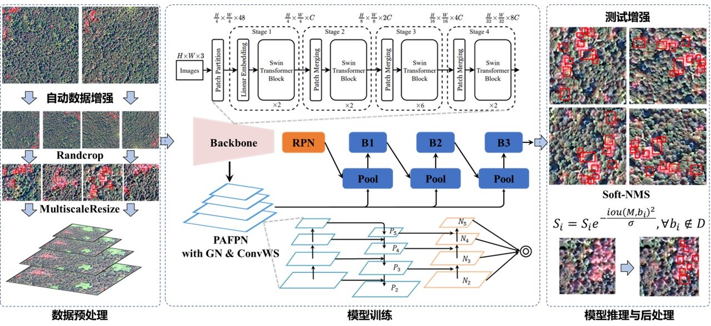

# 2022 iFLYTEK A.I.开发者大赛-高分辨率遥感影像松林变色立木提取挑战赛第二名解决方案

Team id: 4cTRfEC4o
## 获奖方案


- 1.全自动多尺度数据增强：防止数据量较小，导致网络训练过拟合，首先通过旋转扩增样本，其次通过多尺度Resize，Randcrop等组合操作，使得模型自动学习有效的数据增强
- 2.Swin transformer网络骨干：卷积网络的backbone难以有效捕获大尺寸遥感图像中的长距离空间依赖关系，由于transformer在计算机视觉中强大的特征提取能力以及长距离依赖能力，这里使用Swin transformer-base作为backbone，
其中预训练模型采用在ImageNet 22k上的结果。
- 3.PAFPN：引入bottom-up path augmentation结构，充分利用网络浅特征进行分割；引入adaptive feature pooling使得提取到的ROI特征更加丰富。
- 4.Hybrid Task Cascade架构：通过多任务多阶段的混合级联结构，不断对检测的box结果由粗到细迭代增强，对检测偏移的结果进行不断纠正，由于本任务使用的是目标检测架构，因此没有语义mask之间的特征交互。
- 5.GN与ConvWS：在训练过程中batch size较小，采用GN代替BN的方式，来缓解batch较小导致的网络BN层失效，ConvWS用于 标准化卷积层中的权重，通过减少损失和梯度的 Lipschitz 常数来平滑损失情况
- 6.SoftNMS与旋转测试增强：通过水平、垂直反转最终对检测的box进行投票并基于Soft-NMS后处理输出最终结果，有效缓解目标之间较小，位置偏移的问题。

## 1. 环境配置

本地运行的环境配置是针对linux系统和NVIDIA TITAN RTX显卡，如果测试时，遇到环境配置不符合，还请再联系
- CUDA 10.1
- GCC 5.4.0
- PyTorch: 1.7.1
- TorchVision: 0.8.2
- OpenCV: 4.5.2
- MMCV: 1.4.2
- MMCV Compiler: GCC 7.3
- MMCV CUDA Compiler: 10.1
- MMDetection: 2.25.0+

- **1. pytorch安装**
  下载anaconda

  ``` shell
  wget https://mirrors.tuna.tsinghua.edu.cn/anaconda/archive/Anaconda3-2020.11-Linux-x86_64.sh
   ```
  安装anaconda

  ``` shell
  chmod +x Anaconda3-2020.11-Linux-x86_64.sh
  ./Anaconda3-2020.11-Linux-x86_64.sh
   ```
  创建虚拟环境torch_1_7

  ``` shell
  conda create -n torch_1_7 python=3.7
   ```
  进入虚拟环境torch_1_7

  ``` shell
  conda activate torch_1_7
   ```
  安装pytorch

  ``` shell
  conda install pytorch=1.7.1 torchvision torchaudio cudatoolkit=10.1 -c pytorch
   ```
  3080Ti显卡需要CUDA11.0及以上，安装pytorch版本如下

  ``` shell
  conda install pytorch=1.7.1 torchvision torchaudio cudatoolkit=11.0 -c pytorch
   ```
- **2. mmdetection安装**

- 安装MMCV==1.4.2

  ``` shell
  pip install mmcv-full==1.4.2 -f https://download.openmmlab.com/mmcv/dist/cu101/torch1.7.0/index.html
  pip install mmcv-full==1.4.2 -f https://download.openmmlab.com/mmcv/dist/cu110/torch1.8.0/index.html
   ```
若cuda和pytorch是其他版本，修改“cu101”与“torch1.7.0”为对应版本。
  MMDetection 是一个基于 PyTorch 的目标检测开源工具箱。它是 [OpenMMLab](https://openmmlab.com/) 项目的一部分。
  MMDetection安装文档：[快速入门文档](docs/get_started.md)

- 安装MMDetection==2.25+开发者模式
  ``` shell
  cd code
  python setup.py develop
   ```
- **3. 必须的函数包安装**
- 安装skimage,json，tqdm
  ``` shell
  pip install scikit-image
  pip install json
  pip install tqdm
   ```
## 2. 运行说明
- **文件说明**

文件结果如图所示,请您在训练前将初赛的所有原始训练数据的tif格式文件复制到 user_data/train_image 内,
将初赛的标签txt文件复制到user_data/train_label
将复赛的tif格式影像数据全部复制到user_data/fusai_image

- **1. 数据预处理**
  ``` shell
  cd code
  python preprocess/make_data2coco_format.py
  python preprocess/make_test_data2coco_format.py
   ```

运行完成后，生成user_data/train_coco_pw.json与user_data/fusai_test_false.json两个文件

- **2. 预测**
  ``` shell
  sh test.sh
   ```
- **3. 训练**
训练显存需求，2张24g的NVIDIA TITAN RTX显卡
训练复现流程：
- 运行train.sh文件
  ``` shell
  sh train.sh
   ```
若在训练过程中由于网络原因导致预训练模型无法下载，可直接复制链接下载'https://github.com/SwinTransformer/storage/releases/download/v1.0.0/swin_base_patch4_window7_224_22k.pth'，
并手动上传至pytorch存储预训练模型文件夹，.cache/torch/hub/checkpoints/
- 查看日志记录文件
训练结束后生成PW_log_train/swin_b_htc_pafpn_adawm_1x_auto_aug_gn_ws_2x文件夹
- 文件夹内存储checkpoint，选择最好的checkpoint结果进行推理
  ``` shell
  CUDA_VISIBLE_DEVICES=0 python tools/test.py \
      PW_log_train/swin_b_htc_pafpn_adawm_1x_auto_aug_gn_ws_2x/htc_swin_b_pafpn_auto_aug_1x_pretrained_gn_ws_2x.py \
      PW_log_train/swin_b_htc_pafpn_adawm_1x_auto_aug_gn_ws_2x/best_bbox_mAP_epoch_21.pth \
      --format-only \
      --options "jsonfile_prefix=PW_log_train/swin_b_htc_pafpn_adawm_1x_auto_aug_gn_ws_2x/infer_epoch21_test_flip_softnms_rpn_rcnn"
   ```
其中如果是21轮结果最好，则选择best_bbox_mAP_epoch_21.pth文件，若为其他轮，修改对应的轮数参数存储文件即可。
- 存储结果转换
python preprocess/coco2txt.py
注意需修改第4行与第6行对应的预测结果路径为上述jsonfile_prefix的路径


